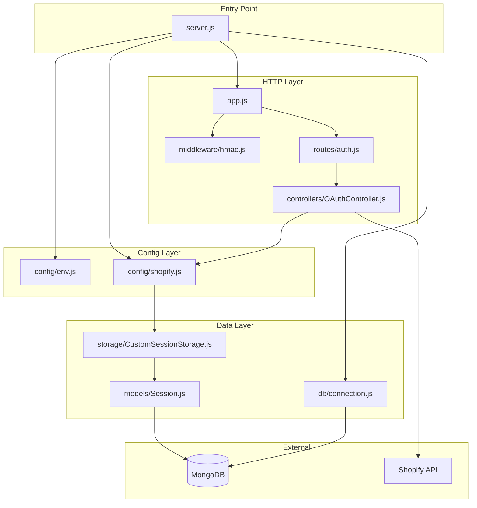
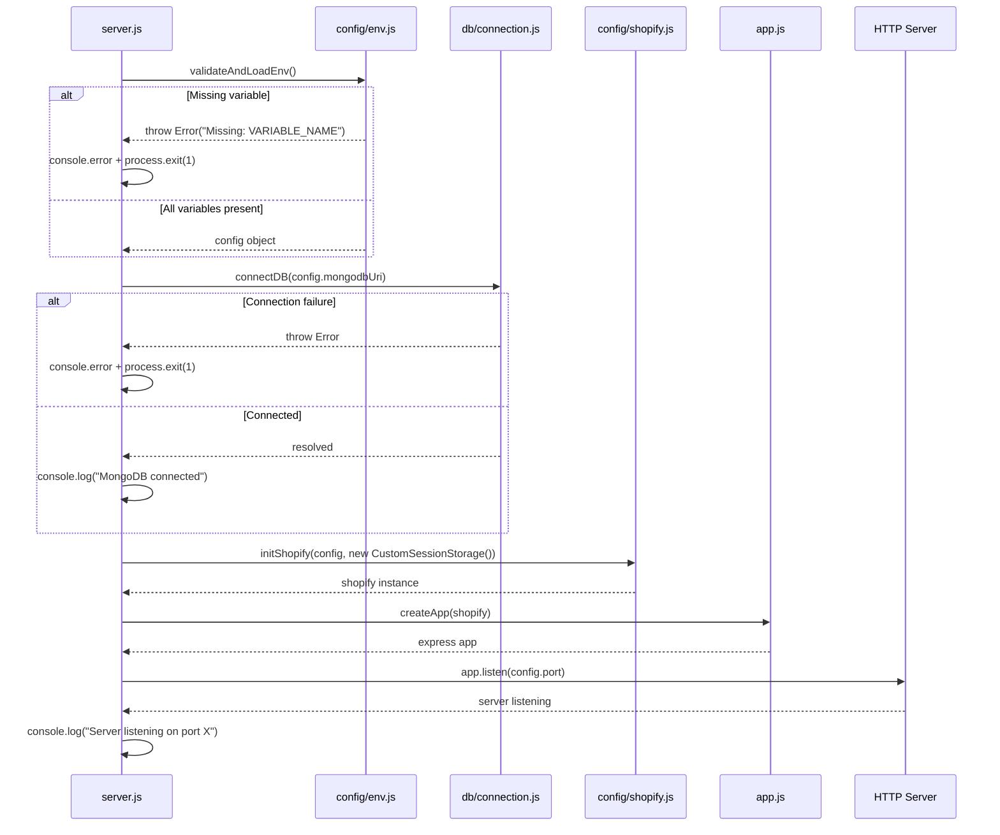
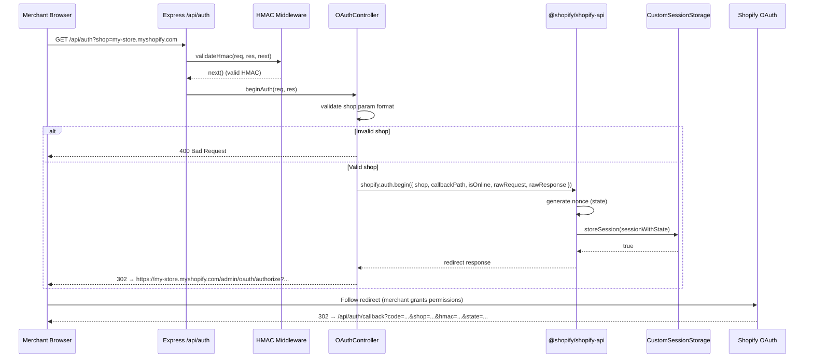
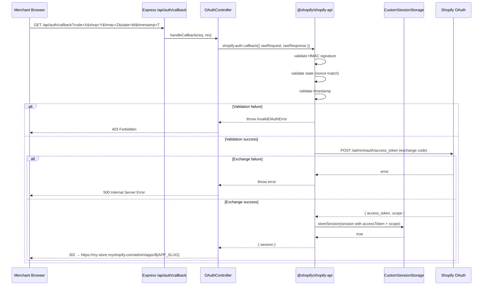

# Design Document — Shopify Express Mongoose Boilerplate

## Overview

This boilerplate establishes a reusable, secure runtime foundation for embedded Shopify applications. The goal is a production-ready Express server that:

1. Validates its environment at startup and fails fast on misconfiguration.
2. Initialises the `@shopify/shopify-api` SDK with a custom MongoDB-backed session store.
3. Exposes the two OAuth routes (`/api/auth` and `/api/auth/callback`) required by the Shopify App Store installation flow.
4. Protects all Shopify-originated requests with HMAC-SHA256 signature validation.

No frontend, app-specific business logic, cron jobs, billing logic, or webhooks (including GDPR/privacy webhooks and app/uninstalled webhook) is in scope for this boilerplate.

---

## Architecture

### MVC Folder Structure

```
shopify-express-mongoose-boilerplate/
├── src/
│   ├── config/
│   │   ├── env.js                  # Environment variable validation & export
│   │   └── shopify.js              # SDK initialisation (shopifyApi call)
│   ├── db/
│   │   └── connection.js           # Mongoose connect / disconnect helpers
│   ├── models/
│   │   └── Session.js              # Mongoose SessionSchema + SessionModel
│   ├── storage/
│   │   └── CustomSessionStorage.js # CustomSessionStorage implementation
│   ├── middleware/
│   │   └── hmac.js                 # HMAC validation middleware
│   ├── controllers/
│   │   └── OAuthController.js      # /api/auth and /api/auth/callback handlers
│   ├── routes/
│   │   └── auth.js                 # Express Router — mounts OAuth routes
│   └── app.js                      # Express app factory (no listen call)
├── server.js                       # Entry point: env → DB → SDK → app → listen
├── .env.example
├── .gitignore
└── package.json
```

**Module responsibilities:**

| Module | Responsibility |
|---|---|
| `config/env.js` | Reads `process.env`, validates required keys, exports a frozen config object |
| `config/shopify.js` | Calls `shopifyApi({...})` once and exports the resulting `shopify` instance |
| `db/connection.js` | Wraps `mongoose.connect()` and `mongoose.disconnect()` |
| `models/Session.js` | Defines `SessionSchema` and exports `SessionModel` |
| `storage/CustomSessionStorage.js` | Implements `storeSession`, `loadSession`, `deleteSession` |
| `middleware/hmac.js` | Validates HMAC-SHA256 on incoming requests |
| `controllers/OAuthController.js` | Delegates to SDK for OAuth begin/callback, handles HTTP responses |
| `routes/auth.js` | Mounts `GET /api/auth` and `GET /api/auth/callback` |
| `app.js` | Creates and configures the Express app (middleware + routes) |
| `server.js` | Orchestrates the startup sequence |

---

## Components and Interfaces

### Component Interaction Diagram



### Key Interfaces

**`config/env.js`** — exports a validated, frozen config object:
```js
// Returns: { apiKey, apiSecretKey, scopes, host, port, mongodbUri, appSlug }
// Throws: Error with missing variable name if any required key is absent
function validateAndLoadEnv(): EnvConfig
```

**`config/shopify.js`** — exports the SDK singleton:
```js
// Returns: Shopify instance (from shopifyApi())
// Depends on: EnvConfig + CustomSessionStorage instance
function initShopify(config: EnvConfig, sessionStorage: CustomSessionStorage): Shopify
```

**`db/connection.js`** — exports connection helpers:
```js
async function connectDB(uri: string): Promise<void>
async function disconnectDB(): Promise<void>
```

**`storage/CustomSessionStorage.js`** — implements the SDK's session storage contract:
```js
class CustomSessionStorage {
  async storeSession(session: Session): Promise<boolean>
  async loadSession(id: string): Promise<Session | undefined>
  async deleteSession(id: string): Promise<boolean>
}
```

**`middleware/hmac.js`** — standard Express middleware signature:
```js
function validateHmac(req: Request, res: Response, next: NextFunction): void
```

**`controllers/OAuthController.js`** — route handler functions:
```js
async function beginAuth(req: Request, res: Response): Promise<void>
async function handleCallback(req: Request, res: Response): Promise<void>
```

---

## Data Models

### Mongoose `SessionSchema`

```js
const SessionSchema = new mongoose.Schema(
  {
    id:               { type: String, required: true, unique: true },
    shop:             { type: String, required: true, index: true },
    state:            { type: String },
    isOnline:         { type: Boolean, default: false },
    scope:            { type: String },
    expires:          { type: Date },
    accessToken:      { type: String },
    onlineAccessInfo: { type: mongoose.Schema.Types.Mixed },
  },
  { timestamps: true }
);
```

**Field descriptions:**

| Field | Type | Notes |
|---|---|---|
| `id` | String | Shopify session ID (e.g. `offline_my-store.myshopify.com`). Primary lookup key. |
| `shop` | String | Store domain (e.g. `my-store.myshopify.com`). Indexed for shop-based queries. |
| `state` | String | OAuth nonce — set during `/api/auth`, cleared after callback. |
| `isOnline` | Boolean | `false` for offline (persistent) tokens; `true` for online (per-user) tokens. |
| `scope` | String | Comma-separated list of granted OAuth scopes. |
| `expires` | Date | Expiry date for online tokens; `null` for offline tokens. |
| `accessToken` | String | The Shopify Admin API access token. |
| `onlineAccessInfo` | Mixed | Extra metadata for online tokens (user info, associated user). |
| `createdAt` / `updatedAt` | Date | Managed automatically by Mongoose `timestamps` option. |

**Index strategy:**
- `id`: unique index (primary lookup by session ID).
- `shop`: secondary index (lookup all sessions for a given store).

---

## Correctness Properties

*A property is a characteristic or behavior that should hold true across all valid executions of a system — essentially, a formal statement about what the system should do.*

### Property 1: Startup fails fast on any missing environment variable

*For any* subset of the required environment variables (`SHOPIFY_API_KEY`, `SHOPIFY_API_SECRET`, `SHOPIFY_SCOPES`, `HOST`, `PORT`, `MONGODB_URI`, `APP_SLUG`) that is absent, the startup validation function SHALL throw an error whose message identifies the name of the missing variable, and the process SHALL not proceed to component initialisation.

**Validates: Requirements 1.3**

---

### Property 2: Startup fails fast on a malformed `MONGODB_URI`

*For any* string value of `MONGODB_URI` that does not begin with `mongodb://` or `mongodb+srv://` (e.g. `"hello"`, `"postgres://..."`, `""`), the startup validation function SHALL throw an error whose message identifies `MONGODB_URI` as malformed, and the process SHALL not proceed to component initialisation.

**Validates: Requirements 1.4**

---

### Property 3: Session storage round-trip

*For any* valid `Session` object (with arbitrary `id`, `shop`, `accessToken`, `scope`, `state`, `isOnline`, `expires`, and `onlineAccessInfo` values), calling `storeSession(session)` followed by `loadSession(session.id)` SHALL return a `Session` object whose fields are equivalent to the original.

**Validates: Requirements 3.2, 3.3, 3.7**

---

### Property 4: Delete removes session permanently

*For any* valid `Session` object that has been persisted via `storeSession`, calling `deleteSession(session.id)` followed by `loadSession(session.id)` SHALL return `undefined`.

**Validates: Requirements 3.4**

---

### Property 5: Invalid shop domain always returns HTTP 400

*For any* string that is not a valid `*.myshopify.com` domain (including empty strings, strings without the `.myshopify.com` suffix, strings with extra path segments, and strings with invalid characters), a `GET /api/auth` request with that value as the `shop` parameter SHALL return an HTTP `400` response.

**Validates: Requirements 5.3**

---

### Property 6: Valid shop domain always triggers a redirect

*For any* valid `*.myshopify.com` shop domain, a `GET /api/auth` request SHALL return an HTTP redirect (3xx) whose `Location` header contains the shop domain and points to a Shopify authorization URL.

**Validates: Requirements 5.1**

---

### Property 7: Each OAuth initiation produces a unique nonce

*For any* two distinct calls to `beginAuth` with valid shop parameters, the `state` (nonce) values persisted in `Session_Storage` for those two calls SHALL be different.

**Validates: Requirements 5.2**

---

### Property 8: Correctly signed requests always pass HMAC validation

*For any* set of query parameters signed with the correct `SHOPIFY_API_SECRET` (with `hmac` excluded from the signing payload and parameters sorted alphabetically), the `validateHmac` middleware SHALL call `next()` and not return a 401 response.

**Validates: Requirements 7.1, 7.2, 7.6, 7.7**

---

### Property 9: Incorrectly signed requests always fail HMAC validation

*For any* set of query parameters where the `hmac` value was computed with a different secret key (or where any parameter value has been tampered with after signing), the `validateHmac` middleware SHALL return an HTTP `401` response with the message `"Invalid HMAC signature"`.

**Validates: Requirements 7.4**

---

### Property 10: Parameter order does not affect HMAC validation outcome

*For any* set of query parameters that form a valid HMAC-signed request, reordering those parameters in the query string SHALL not change the validation result — the middleware SHALL still call `next()`.

**Validates: Requirements 7.7**

---

## Error Handling

### Strategy

The application uses a **fail-fast** strategy at startup and a **structured error response** strategy at runtime.

**Startup errors (fatal):**

| Condition | Behaviour |
|---|---|
| Missing required env var | Log descriptive message → `process.exit(1)` |
| MongoDB connection failure | Log descriptive message → `process.exit(1)` |
| SDK initialisation failure | Throw descriptive exception → caught by `server.js` → `process.exit(1)` |

**Runtime errors (HTTP responses):**

| Condition | HTTP Status | Response body |
|---|---|---|
| Missing `shop` param on `/api/auth` | `400` | `{ error: "Missing shop parameter" }` |
| Invalid `shop` format on `/api/auth` | `400` | `{ error: "Invalid shop domain. Must match *.myshopify.com" }` |
| Missing `hmac` on any protected route | `401` | `{ error: "Missing HMAC" }` |
| HMAC mismatch | `401` | `{ error: "Invalid HMAC signature" }` |
| OAuth callback validation failure | `403` | `{ error: "OAuth callback validation failed: <reason>" }` |
| Shopify token exchange failure | `500` | `{ error: "Token exchange failed: <reason>" }` |
| Unexpected server error | `500` | `{ error: "Internal server error" }` |

**Token/secret protection:**

Access tokens and API secrets must never appear in log output, error messages, or HTTP response bodies. Error handlers must reference tokens by type (e.g., "access token") rather than value.

**Error propagation in `CustomSessionStorage`:**

MongoDB errors are not swallowed. Each method (`storeSession`, `loadSession`, `deleteSession`) lets exceptions propagate to the caller (the SDK), which is responsible for handling them at the OAuth layer.

**Global error handler:**

`app.js` registers a final Express error-handling middleware `(err, req, res, next)` that catches any unhandled errors thrown by route handlers and returns a `500` response, preventing raw stack traces from leaking to clients.

---

## Startup Sequence



---

## OAuth Callback Flow

On successful callback, the app redirects to `https://${session.shop}/admin/apps/${config.appSlug}` — the `APP_SLUG` env var makes this configurable per-app.

Note: Webhook registration will be added post-callback in app-specific implementations.

### OAuth Installation Flow (Sequence Diagram)



### OAuth Callback Flow (Sequence Diagram)



---

## HMAC Validation Algorithm

The `validateHmac` middleware implements the [Shopify HMAC verification specification](https://shopify.dev/docs/apps/build/authentication-authorization/client-side-auth/use-hmac-validation):

```
Algorithm:
1. Extract all query parameters from req.query.
2. If 'hmac' key is absent → respond 401 "Missing HMAC".
3. Extract and remove the 'hmac' key from the parameter map.
4. Sort remaining keys alphabetically.
5. Build the message string: "key1=value1&key2=value2&..." (sorted order).
6. Compute HMAC-SHA256 of the message using SHOPIFY_API_SECRET as the key.
7. Encode the digest as a lowercase hex string.
8. Convert both the computed digest and the provided hmac to Buffer via Buffer.from(..., 'hex').
9. Compare using crypto.timingSafeEqual(computedBuffer, providedBuffer).
10. If lengths differ or comparison fails → respond 401 "Invalid HMAC signature".
11. If equal → call next().
```

**Security notes:**
- Step 9 uses `crypto.timingSafeEqual` to prevent timing-based side-channel attacks.
- Step 3 ensures the `hmac` parameter itself is never included in the signed payload.
- Step 4 ensures parameter ordering is deterministic.

---

## Testing Strategy

### Dual Testing Approach

Both unit/example-based tests and property-based tests are used. Unit tests cover specific scenarios, integration points, and error conditions. Property-based tests verify universal correctness across a wide input space.

### Property-Based Testing Library

**Library:** [`fast-check`](https://github.com/dubzzz/fast-check)

Each property-based test runs a **minimum of 100 iterations** with randomly generated inputs.

Each test is tagged with:
```
// Feature: shopify-express-mongoose-boilerplate, Property N: <property text>
```

### Property-Based Tests

| Property | Test Description | fast-check Arbitraries |
|---|---|---|
| **Property 1** | For any subset of missing env vars, startup throws with the missing var name | `fc.subarray(requiredVars, { minLength: 1 })` |
| **Property 2** | For any malformed `MONGODB_URI`, startup throws identifying it as malformed | `fc.string()` filtered to exclude valid prefixes |
| **Property 3** | For any valid session, `storeSession` then `loadSession` returns equivalent session | `fc.record(...)` |
| **Property 4** | For any valid session, `storeSession` then `deleteSession` then `loadSession` returns `undefined` | Same as Property 3 |
| **Property 5** | For any invalid shop string, `GET /api/auth` returns 400 | `fc.string()` filtered |
| **Property 6** | For any valid shop domain, `GET /api/auth` returns a redirect | `fc.stringMatching(...)` |
| **Property 7** | For any two OAuth initiations, nonces are different | Two valid shop domains |
| **Property 8** | For any params signed with correct secret, middleware calls `next()` | `fc.dictionary(...)` |
| **Property 9** | For any params signed with wrong secret, middleware returns 401 | Same + wrong secret |
| **Property 10** | For any valid signed params, shuffling order doesn't change outcome | `fc.shuffledSubarray(...)` |

### Unit Tests

| Test | Covers |
|---|---|
| `env.js` — all required vars present → returns config | Req 1.1, 1.2 |
| `env.js` — missing each var individually → throws with var name | Req 1.3 |
| `env.js` — `MONGODB_URI` present but malformed → throws | Req 1.4 |
| `app.js` — JSON body is parsed correctly | Req 1.5 |
| `app.js` — URL-encoded body is parsed correctly | Req 1.5 |
| `app.js` — global error handler returns 500 without stack trace | Req 1.5 |
| `shopify.js` — SDK initialised with all required params | Req 2.1, 2.2, 2.4 |
| `shopify.js` — `isEmbeddedApp` set to `true` | Req 2.1 |
| `shopify.js` — URL cleaning handles protocol and trailing slashes | Req 2.1 |
| `shopify.js` — scopes string parsed into trimmed array | Req 2.1 |
| `shopify.js` — missing apiKey → throws | Req 2.3 |
| `Session.js` — schema has all required fields with correct types | Req 3.1 |
| `Session.js` — shop field has an index | Req 3.6 |
| `CustomSessionStorage` — MongoDB error in storeSession propagates | Req 3.5 |
| `CustomSessionStorage` — MongoDB error in loadSession propagates | Req 3.5 |
| `CustomSessionStorage` — MongoDB error in deleteSession propagates | Req 3.5 |
| `db/connection.js` — connection failure → rejects with error | Req 4.2 |
| `OAuthController.beginAuth` — missing shop → 400 | Req 5.3 |
| `OAuthController.beginAuth` — invalid shop format → 400 | Req 5.3 |
| `OAuthController.handleCallback` — valid params → SDK called, session stored, redirect | Req 6.1, 6.2, 6.3 |
| `OAuthController.handleCallback` — SDK validation failure → 403 | Req 6.4 |
| `OAuthController.handleCallback` — token exchange failure → 500 | Req 6.5 |
| `hmac.js` — missing hmac param → 401 "Missing HMAC" | Req 7.3 |

### Integration Tests

| Test | Covers |
|---|---|
| Full OAuth installation flow (mocked Shopify) — end-to-end from `/api/auth` to redirect | Req 5.1, 5.2, 5.4 |
| Full OAuth callback flow (mocked Shopify) — end-to-end from `/api/auth/callback` to redirect | Req 6.1–6.6 |
| MongoDB connection established before server listens | Req 4.1, 4.3 |
